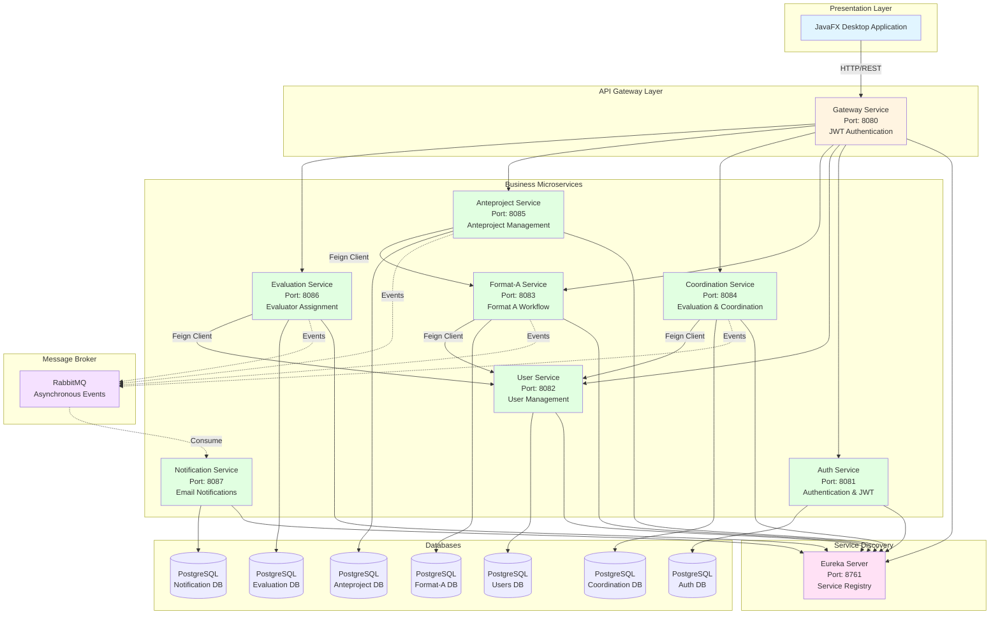

# Graduate Project Management System - FIET

<div align="center">


**Comprehensive system for managing the graduate project process at the Faculty of Electronics and Telecommunications Engineering (FIET) of the University of Cauca**

[Features](#-main-features) •
[Architecture](#-system-architecture) •
[Technologies](#-technology-stack) •
[Installation](#-installation-and-configuration) •
[Team](#-development-team)

</div>

---

## Project Description

The **Graduate Project Management System** is a complete platform designed to digitalize and optimize the workflow of degree projects at FIET. The system allows teachers, students, coordinators, and department heads to efficiently manage the entire lifecycle of a degree project, from the initial submission of Format A to the evaluation of the anteproject.

### Objectives

- **Digitalize** the graduate project management process
- **Automate** notifications and approval flows
- **Centralize** project information in a single platform
- **Facilitate** communication between all process actors
- **Guarantee** traceability and tracking of each project

---

## Main Features

### For Teachers
- Registration in the system with institutional credential validation
- Submission of Format A with complete project information
- Resubmission of rejected Format A (up to 3 attempts)
- Anteproject upload once Format A is approved
- Project status visualization

### For Students
- Real-time consultation of their project status
- Reception of notifications about evaluations
- Project progress tracking

### For Program Coordinators
- Evaluation of submitted Format A
- Approval or rejection with detailed observations
- Complete list of projects and their statuses
- Automatic notifications of new submissions

### For Department Heads
- Visualization of submitted anteprojects
- Assignment of department evaluators
- Automatic notification to designated evaluators

---

## System Architecture

The system is built following a **microservices architecture**, ensuring scalability, maintainability, and decoupling of responsibilities.

### Architecture Diagram



### System Components

#### 1. **Presentation Layer** (JavaFX)
- Desktop application developed with JavaFX 21
- Intuitive graphical interface for all user roles
- Communication with microservices via API Gateway

#### 2. **API Gateway** (Spring Cloud Gateway)
- Single entry point for all requests
- Authentication and authorization with JWT
- Dynamic routing to microservices
- Circuit breaker with Resilience4j

#### 3. **Service Discovery** (Eureka)
- Service registration and discovery
- Automatic load balancing
- High availability of services

#### 4. **Business Microservices**

| Service | Port | Responsibility |
|----------|--------|-----------------|
| **auth-service** | 8081 | User authentication, JWT token generation |
| **user-service** | 8082 | User management (teachers, students, coordinators) |
| **format-a-service** | 8083 | Format A management, validations, attempt control |
| **coordination-service** | 8084 | Format A evaluation, approvals/rejections |
| **anteproject-service** | 8085 | Anteproject management, document upload |
| **evaluation-service** | 8086 | Evaluator assignment, evaluation management |
| **notification-service** | 8087 | Email sending (asynchronous) |

#### 5. **Message Broker** (RabbitMQ)
- Asynchronous communication between microservices
- Event pattern for notifications
- Service decoupling

#### 6. **Databases** (PostgreSQL)
- Independent database per microservice
- Data isolation and service autonomy

---

## Technology Stack

### Backend
- **Java 17** - Programming language
- **Spring Boot 3.2.0** - Main framework
- **Spring Cloud 2023.0.0** - Microservices and cloud-native patterns
  - Spring Cloud Gateway - API Gateway
  - Spring Cloud Netflix Eureka - Service Discovery
  - Spring Cloud OpenFeign - Declarative HTTP Client
  - Resilience4j - Circuit Breaker
- **Spring Data JPA** - Data persistence
- **Spring AMQP** - RabbitMQ integration
- **Spring Security** - Security
- **Hexagonal Architecture** - Ports & Adapters in anteproject-service

### Frontend
- **JavaFX 21** - Framework for desktop applications
- **Jackson** - JSON serialization/deserialization

### Databases
- **PostgreSQL** - Relational database

### Messaging
- **RabbitMQ** - Message broker for asynchronous communication

### Authentication
- **JWT (JSON Web Tokens)** - Stateless authentication
- **JJWT 0.11.5** - Library for JWT handling

### Containerization and Deployment
- **Docker** - Service containerization
- **Docker Compose** - Container orchestration for development

### Development Tools
- **Maven** - Dependency management and build
- **Git** - Version control
- **Lombok** - Boilerplate code reduction

---

## Functional Requirements

The system implements the following high-value functional requirements:

### FR-01: Teacher Registration
**As a** teacher **I need** to register in the system **to** start a degree project flow.

**Required data:**
- Names and surnames
- Mobile phone (optional)
- Academic program (Systems Engineering, Electronics and Telecommunications Engineering, Industrial Automation, Telematics Technology)
- Institutional email
- Password (minimum 6 characters, at least one digit, one special character, and one uppercase letter)

### FR-02: Format A Submission
**As a** teacher **I need** to upload Format A **to** begin the degree project process.

**Form data:**
- Project title
- Modality (Research, Professional Practice)
- Current date
- Project director
- Project codirector
- General objective
- Specific objectives
- Attached PDF file
- Company acceptance letter (if Professional Practice)

> **Note:** The system sends an asynchronous notification to the coordinator upon Format A submission.

### FR-03: Format A Evaluation
**As a** coordinator **I need** to evaluate a Format A **to** approve, reject, or leave observations.

**Functionalities:**
- List of projects with their status
- Evaluation with options: Approved, Rejected
- Observations field
- Automatic notification to involved teachers and students

### FR-04: Format A Resubmission
**As a** teacher **I need** to upload a new version of Format A **to** continue the process after a rejection.

**Business rules:**
- Attempt control (maximum 3)
- Definitive rejection after the third attempt
- Asynchronous notification to the coordinator on each resubmission

### FR-05: Status Consultation (Student)
**As a** student **I need** to view the status of my project **to** track the process.

**Possible statuses:**
- In first Format A evaluation
- In second Format A evaluation
- In third Format A evaluation
- Format A accepted
- Format A rejected

### FR-06: Anteproject Upload
**As a** teacher **I need** to upload the anteproject **to** continue the process after Format A approval.

**Functionalities:**
- Upload of anteproject document
- Submission date registration
- Asynchronous notification to the department head

### FR-07: Anteproject List
**As a** department head **I need** to view submitted anteprojects **to** proceed with evaluator assignment.

**Functionalities:**
- Visualization of pending anteprojects
- Project information and director teacher

### FR-08: Evaluator Assignment
**As a** department head **I need** to delegate two evaluator teachers **to** evaluate an anteproject.

**Functionalities:**
- Selection of two evaluators from the department
- Automatic notification to designated evaluators

---

## Installation and Configuration

### Prerequisites

- **Docker Desktop** installed and running
- **Java 17** (to run the desktop application)
- **Maven** (to run the desktop application)

### 1. Clone the Repository

```bash
git clone https://github.com/Julianste15/ProcessManagement.git
cd ProcessManagement
```

### 2. Run with Docker Compose

This single command will build all microservices, start the databases, RabbitMQ, and register everything in Eureka.

```bash
docker-compose up -d --build
```

**Verify services are running:**
- **Eureka Dashboard:** `http://localhost:8761`
- **Gateway:** `http://localhost:8080`
- **RabbitMQ:** `http://localhost:15672` (guest/guest)

### 3. Run Desktop Application

Once the microservices are up, open a new terminal and run the presentation layer:

```bash
cd ProccesManagementMicroservices/presentation
mvn javafx:run
```

---

## 🐳 Dockerization

The project is fully dockerized to ensure a consistent development environment.

### Dockerized Services

All components are containerized:
- **Infrastructure:**
    - PostgreSQL (Database)
    - RabbitMQ (Message Broker)
    - Eureka Server (Service Discovery)
    - API Gateway
- **Microservices:**
    - Auth Service
    - User Service
    - Format-A Service
    - Coordination Service
    - Anteproject Service
    - Evaluation Service
    - Notification Service

### Docker Commands

```bash
# Start all services
docker-compose up -d

# View logs
docker-compose logs -f

# View logs of specific service
docker-compose logs -f user-service

# Stop services
docker-compose down

# Rebuild images
docker-compose up --build

# Stop and remove volumes (database reset)
docker-compose down -v
```

### Docker Configuration

The `docker-compose.yml` file handles:
- **Network:** `microservices-network` for internal communication.
- **Volúmenes:** Persistent storage for PostgreSQL (`postgres-data`) and file uploads (`./storage`).
- **init.sql:** Automatic creation of all required databases on startup.
- **Environment Variables:** Automatic injection of DB credentials and service URLs.

### Dockerization Status

- [x] format-a-service
- [x] anteproject-service
- [x] evaluation-service
- [x] notification-service
- [x] gateway-service
- [x] discovery-service
- [x] RabbitMQ
- [x] auth-service
- [x] application.yml configuration for Docker profiles

---

## Project Structure

```
ProccesManagementMicroservices/
├── discovery-service/          # Eureka Server
├── gateway-service/            # API Gateway
├── auth-service/               # Authentication
├── user-service/               # User Management
├── format-a-service/           # Format A Management
├── coordination-service/       # Coordination & Evaluation
├── anteproject-service/        # Anteproject Management
├── evaluation-service/         # Evaluator Assignment
├── notification-service/       # Notifications
├── presentation/               # JavaFX Application
└── storage/                    # File Storage
```

---

## Security

The system implements the following security measures:

- **JWT Authentication:** Secure tokens for stateless authentication
- **Password Validation:** Complexity requirements (minimum 6 characters, uppercase, digits, special characters)
- **API Gateway:** Single entry point with token validation
- **Roles and Permissions:** Role-based access control (TEACHER, COORDINATOR, DEPARTMENT_HEAD, STUDENT)

---

## Patterns and Best Practices

### Architectural Patterns
- **API Gateway Pattern:** Single entry point
- **Service Discovery Pattern:** Dynamic service registration
- **Event-Driven Architecture:** Asynchronous communication with events
- **Circuit Breaker Pattern:** Resilience against failures
- **Database per Service:** Data autonomy per microservice
- **Hexagonal Architecture (Ports & Adapters):** Implemented in anteproject-service

### Design Patterns Implemented

The project implements **6 classic design patterns**. For detailed documentation, see [DESIGN_PATTERNS.md](./DESIGN_PATTERNS.md).

| Pattern | Microservice | Purpose |
|--------|---------------|----------|
| **State** | format-a-service | FormatA lifecycle management |
| **Builder** | user-service | User object construction with validation |
| **Adapter** | anteproject-service | Hexagonal architecture - input/output adapters |
| **Decorator** | notification-service | Decorated logging in email service |
| **Factory** | notification-service | Centralized email message creation |
| **Facade** | presentation | Simplification of backend interactions |

**Distribution by category:**
- **Behavioral Patterns:** State (1)
- **Creational Patterns:** Builder, Factory (2)
- **Structural Patterns:** Adapter, Decorator, Facade (3)

### Hexagonal Architecture

The **anteproject-service** implements full hexagonal architecture:

```
domain/
  ├── model/              # Domain entities
  └── ports/
      ├── in/             # Use cases (input ports)
      └── out/            # Output interfaces
application/
  └── service/            # Use case implementation
infrastructure/
  ├── input/              # Input adapters (REST, Events)
  └── output/             # Output adapters (DB, Clients, Events)
```

**Benefits:**
- ✅ Domain independent of frameworks
- ✅ Improved testability with port mocks
- ✅ Flexibility to change infrastructure technologies

### SOLID Principles
- **Single Responsibility:** Each microservice has a unique responsibility
- **Open/Closed:** Extensible through new microservices and patterns
- **Dependency Inversion:** Use of interfaces, ports, and abstractions

---

## Testing

```bash
# Run unit tests
mvn test

# Run tests for a specific service
cd [service-name]
mvn test
```

---

## API Documentation

The project includes interactive documentation generated with **Swagger/OpenAPI**.

### Accessing Documentation

Once microservices are started, you can access the Swagger UI interface to explore and test endpoints:

| Service | Swagger UI URL |
|----------|-------------------|
| **format-a-service** | `http://localhost:8083/swagger-ui/index.html` |
| *Other services* | *Coming soon* |

---

## Roadmap and Future Improvements

### Completed ✅
- [x] API Documentation with Swagger/OpenAPI (Implemented in format-a-service)
- [x] Containerization with Docker (All services)
- [x] Implementation of design patterns (6 patterns implemented)
- [x] Hexagonal Architecture (anteproject-service)

### In Progress 🚧
- [ ] Integration tests implementation

### Planned 📋
- [ ] Metrics and monitoring with Prometheus and Grafana
- [ ] Orchestration with Kubernetes
- [ ] CI/CD with GitHub Actions

---

## Development Team

This project was developed by Systems Engineering students at the University of Cauca as part of the Software II course:

| Name | Role | GitHub |
|--------|-----|--------|
| **Julian Camacho** | Full Stack Developer | [@Julianste15](https://github.com/Julianste15) |
| **Oscar Cabezas** | Backend Developer | [@Oscar-cm14](https://github.com/Oscar-cm14) |
| **Santiago Hurtado** | Backend Developer | - |

### Academic Context

**University:** University of Cauca
**Faculty:** Faculty of Electronics and Telecommunications Engineering (FIET)
**Program:** Systems Engineering
**Course:** Software II
**Year:** 2025

---

## License

This project is open source and available under the MIT license.

---

## Contact and Support

For questions, suggestions, or to report issues:

- **Issues:** [GitHub Issues](https://github.com/Julianste15/ProcessManagement/issues)
- **Email:** [Contact team]

---

<div align="center">

**⭐ If this project was useful to you, consider giving it a star on GitHub ⭐**

Developed by students of the University of Cauca

</div>
