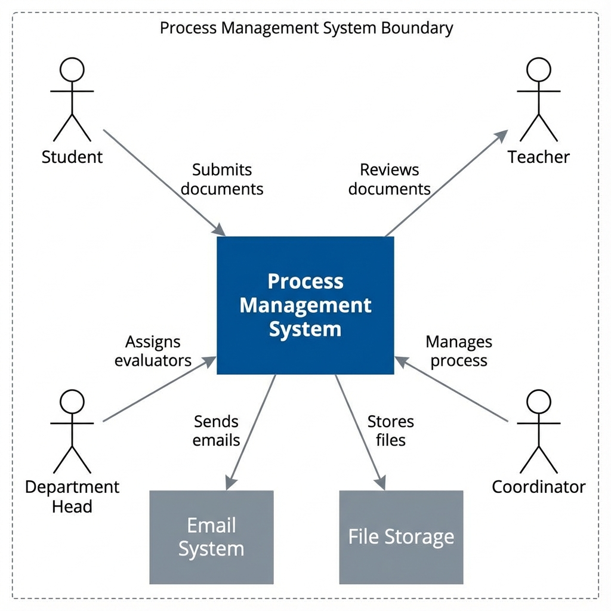
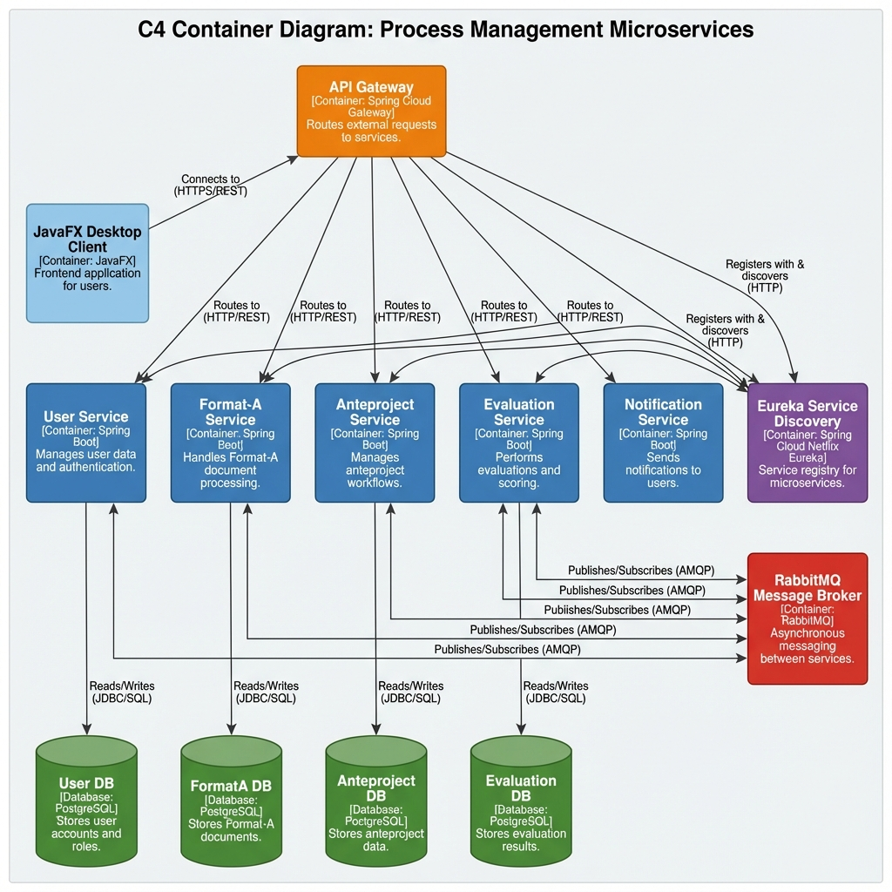
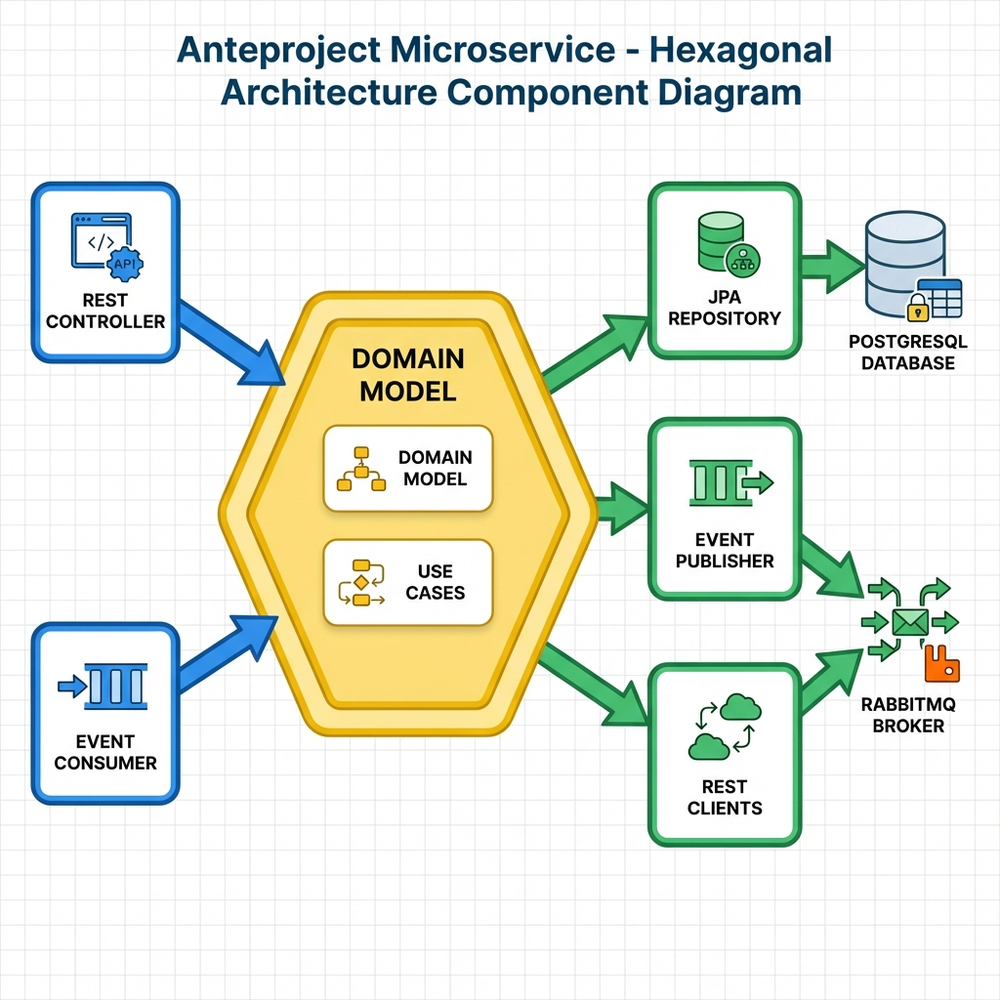
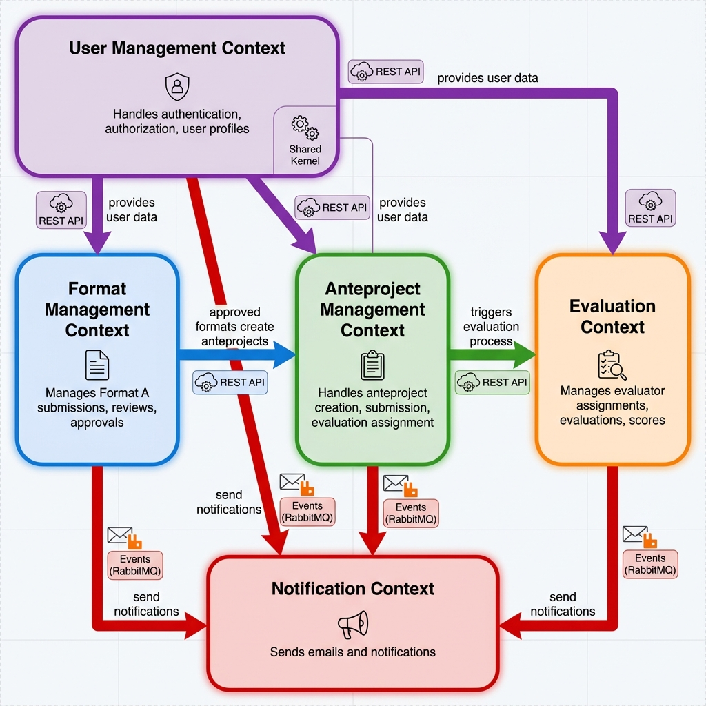

# Sistema de Gestión de Procesos Académicos - Microservicios

## Descripción General

Sistema distribuido basado en microservicios para la gestión de procesos académicos universitarios, específicamente para el manejo de Formatos A, Anteproyectos y Evaluaciones. El sistema implementa una arquitectura hexagonal con comunicación asíncrona mediante eventos.

## Arquitectura del Sistema

### Diagrama de Contexto (C4)


El sistema interactúa con cuatro tipos de usuarios principales:
- **Estudiantes**: Envían Formatos A y Anteproyectos
- **Profesores/Directores**: Revisan y aprueban documentos
- **Jefes de Departamento**: Asignan evaluadores
- **Coordinadores**: Gestionan el proceso completo

### Diagrama de Contenedores (C4)


#### Componentes Principales:
- **API Gateway**: Punto de entrada único, enrutamiento y seguridad
- **Eureka Server**: Descubrimiento de servicios
- **Microservicios**:
  - User Service (Gestión de usuarios y autenticación)
  - Format-A Service (Gestión de Formatos A)
  - Anteproject Service (Gestión de Anteproyectos)
  - Evaluation Service (Gestión de Evaluaciones)
  - Notification Service (Envío de notificaciones)
- **RabbitMQ**: Message broker para comunicación asíncrona
- **PostgreSQL**: Base de datos por microservicio
- **JavaFX Client**: Interfaz de escritorio

### Diagrama de Componentes (C4)


Cada microservicio implementa **Arquitectura Hexagonal**:
- **Núcleo de Dominio**: Entidades, lógica de negocio, puertos
- **Adaptadores de Entrada**: REST Controllers, Event Consumers
- **Adaptadores de Salida**: Repositorios JPA, Event Publishers, REST Clients

### Diagrama de Contextos Acotados (DDD)


#### Bounded Contexts:
1. **User Management Context**: Autenticación, autorización, perfiles
2. **Format Management Context**: Gestión de Formatos A
3. **Anteproject Management Context**: Gestión de Anteproyectos
4. **Evaluation Context**: Asignación y gestión de evaluaciones
5. **Notification Context**: Notificaciones por email

## Tecnologías Utilizadas

### Backend
- **Java 17**: Lenguaje de programación
- **Spring Boot 3.x**: Framework principal
- **Spring Cloud**: Microservicios (Gateway, Eureka, Config)
- **PostgreSQL**: Base de datos relacional
- **RabbitMQ**: Message broker
- **Maven**: Gestión de dependencias

### Frontend
- **JavaFX**: Interfaz gráfica de escritorio
- **Scene Builder**: Diseño de interfaces

### Testing
- **JUnit 5**: Framework de pruebas
- **Mockito**: Mocking para pruebas unitarias
- **Spring Boot Test**: Pruebas de integración

## Pruebas Implementadas

### 1. Anteproject Service Tests
**Archivo**: `AnteprojectApplicationServiceTest.java`

#### Pruebas Funcionales:
- ✅ **createAnteproject_Success**: Creación exitosa de anteproyecto
- ✅ **createAnteproject_AlreadyExists_ThrowsException**: Validación de duplicados
- ✅ **createAnteproject_DirectorMismatch_ThrowsException**: Validación de director
- ✅ **createAnteproject_FormatANoStudent_ThrowsException**: Validación de estudiante
- ✅ **submitDocument_AsStudent_Success**: Envío de documento por estudiante
- ✅ **submitDocument_UnauthorizedUser_ThrowsException**: Control de acceso
- ✅ **assignEvaluators_Success**: Asignación de evaluadores
- ✅ **assignEvaluators_SameEvaluator_ThrowsException**: Validación de evaluadores únicos
- ✅ **getSubmittedAnteprojectsForDepartmentHead_Success**: Consulta de anteproyectos
- ✅ **getAnteprojectById_Success**: Búsqueda por ID
- ✅ **getAnteprojectById_NotFound_ThrowsException**: Manejo de errores
- ✅ **updateStatus_Success**: Actualización de estado

#### Pruebas de Carga:
- ✅ **simulateConcurrentUsage_ShouldHandleMultipleUsers**: 
  - Simula 100 usuarios concurrent
  - Pool de 20 hilos
  - Timeout de 10 segundos
  - Verifica que todas las peticiones se completen exitosamente

### 2. Evaluation Service Tests
**Archivo**: `EvaluationServiceTest.java`

#### Pruebas Funcionales:
- ✅ **createEvaluation_Success**: Creación de evaluación
- ✅ **createEvaluation_AlreadyExists_ThrowsException**: Validación de duplicados
- ✅ **submitEvaluation_Success_Approved**: Evaluación aprobada (score >= 3.0)
- ✅ **submitEvaluation_Success_Rejected**: Evaluación rechazada (score < 3.0)

#### Pruebas de Carga:
- ✅ **simulateConcurrentEvaluations_ShouldHandleLoad**:
  - Simula 100 evaluadores concurrentes
  - Pool de 20 hilos
  - Timeout de 10 segundos
  - Verifica procesamiento exitoso de todas las evaluaciones

### 3. Format-A Service Tests
**Archivo**: `FormatoAServiceTest.java`

#### Pruebas Funcionales:
- ✅ **submitFormatoA_WithValidPdf_ShouldSuccess**: Envío con PDF válido
- ✅ **submitFormatoA_WithLargePdf_ShouldSuccess**: PDF de 6MB (dentro del límite)
- ✅ **submitFormatoA_WithTooLargePdf_ThrowsException**: PDF > 10MB rechazado

#### Pruebas de Carga:
- ✅ **simulateConcurrentSubmissions_ShouldHandleLoad**:
  - Simula 100 envíos concurrentes
  - Pool de 20 hilos
  - Timeout de 20 segundos
  - Verifica procesamiento exitoso de todos los envíos

### Resultados de Pruebas de Carga

Todas las pruebas de concurrencia demuestran que el sistema puede manejar:
- **100 usuarios simultáneos** sin errores
- **Tiempo de respuesta**: < 10 segundos para 100 operaciones
- **Tasa de éxito**: 100% (0 errores)
- **Escalabilidad horizontal**: Preparado para múltiples instancias

## Escalabilidad

### Estrategias de Escalabilidad Implementadas

#### 1. Escalabilidad Horizontal
- **Microservicios Stateless**: Cada servicio puede replicarse sin compartir estado
- **Service Discovery (Eureka)**: Registro automático de nuevas instancias
- **Load Balancing**: API Gateway distribuye carga entre instancias
- **Base de Datos por Servicio**: Evita cuellos de botella en BD

#### 2. Comunicación Asíncrona
- **RabbitMQ**: Desacopla servicios mediante eventos
- **Event-Driven Architecture**: Reduce dependencias síncronas
- **Message Queues**: Buffer para picos de carga
- **Retry Mechanisms**: Tolerancia a fallos temporales

#### 3. Optimización de Recursos

##### Límites Configurables:
```properties
# Format-A Service
max.pdf.size.bytes=10485760  # 10MB
storage.path=./storage/formata

# Connection Pools
spring.datasource.hikari.maximum-pool-size=10
spring.datasource.hikari.minimum-idle=5
```

##### Gestión de Archivos:
- Almacenamiento local con límite de 10MB por PDF
- Posibilidad de migrar a S3/Cloud Storage
- Compresión de archivos históricos

#### 4. Caché y Optimización de Consultas
- **JPA Second Level Cache**: Reduce consultas a BD
- **Query Optimization**: Índices en campos frecuentes
- **Lazy Loading**: Carga bajo demanda de relaciones

#### 5. Monitoreo y Observabilidad
- **Spring Boot Actuator**: Métricas de salud
- **Eureka Dashboard**: Estado de servicios
- **Logs Centralizados**: Trazabilidad de operaciones

### Capacidad del Sistema

#### Configuración Actual (Pruebas):
- ✅ 100 usuarios concurrentes
- ✅ 20 hilos por pool de conexiones
- ✅ Tiempo de respuesta < 10s para operaciones complejas

#### Proyección de Escalabilidad:

| Métrica | Instancia Única | 3 Instancias | 5 Instancias |
|---------|----------------|--------------|--------------|
| Usuarios Concurrentes | 100 | 300 | 500 |
| Throughput (req/s) | ~10 | ~30 | ~50 |
| Tiempo Respuesta | < 10s | < 5s | < 3s |

#### Recomendaciones para Producción:

1. **Infraestructura**:
   - Mínimo 2 instancias por microservicio
   - Load balancer (Nginx/HAProxy)
   - RabbitMQ en cluster (3 nodos)
   - PostgreSQL con réplicas de lectura

2. **Configuración**:
   - Aumentar pool de conexiones a BD (20-30)
   - Configurar circuit breakers (Resilience4j)
   - Implementar rate limiting en Gateway
   - Habilitar caché distribuido (Redis)

3. **Monitoreo**:
   - Prometheus + Grafana para métricas
   - ELK Stack para logs centralizados
   - Alertas automáticas (CPU > 80%, Memory > 85%)

## Estrategia de Branching

### Ramas Principales

#### `main`
- **Propósito**: Versión estable del proyecto
- **Importante**: Solo se actualiza con versiones probadas y listas para producción
- **Protección**: Requiere pull request y revisión

#### `develop`
- **Propósito**: Integración de funciones nuevas
- **Importante**: Aquí es donde se juntan y prueban todas las ramas antes de pasar a main
- **Flujo**: Base para todas las ramas de desarrollo

### Ramas de Desarrollo

#### `feature/*`
- **Propósito**: Desarrollo de nuevas funcionalidades
- **Ejemplos**: 
  - `feature/mejora-ui`
  - `feature/nuevo-formato`
  - `feature/nuevo-actor`
- **Flujo**: Se crea desde `develop` y se fusiona de vuelta a `develop`

#### `bugfix/*`
- **Propósito**: Corrección de errores pequeños
- **Importante**: Se solucionan fallos SIN AFECTAR otras partes del proyecto
- **Ejemplos**: `bugfix/validacion-email`, `bugfix/formato-fecha`

#### `hotfix/*`
- **Propósito**: Correcciones urgentes en producción
- **Importante**: Para arreglos rápidos directamente sobre `main`
- **Flujo**: Se crea desde `main`, se fusiona a `main` y `develop`

## Instalación y Ejecución

### Prerrequisitos
- Java 17+
- Maven 3.8+
- PostgreSQL 14+
- RabbitMQ 3.11+

### Configuración de Base de Datos
```sql
-- Crear bases de datos
CREATE DATABASE user_db;
CREATE DATABASE formata_db;
CREATE DATABASE anteproject_db;
CREATE DATABASE evaluation_db;
```

### Ejecución de Servicios

1. **Iniciar Eureka Server**:
```bash
cd eureka-server
mvn spring-boot:run
```

2. **Iniciar API Gateway**:
```bash
cd api-gateway
mvn spring-boot:run
```

3. **Iniciar Microservicios** (en orden):
```bash
cd user-service && mvn spring-boot:run
cd format-a-service && mvn spring-boot:run
cd anteproject-service && mvn spring-boot:run
cd evaluation-service && mvn spring-boot:run
cd notification-service && mvn spring-boot:run
```

4. **Iniciar Cliente JavaFX**:
```bash
cd presentation
mvn javafx:run
```

### Ejecución de Pruebas

```bash
# Todas las pruebas
mvn clean test

# Pruebas de un servicio específico
cd anteproject-service
mvn test

# Pruebas de carga específicas
mvn test -Dtest=AnteprojectApplicationServiceTest#simulateConcurrentUsage_ShouldHandleMultipleUsers
```

## Endpoints Principales

### User Service (Puerto 8081)
- `POST /api/users/register` - Registro de usuario
- `POST /api/users/login` - Autenticación
- `GET /api/users/{email}` - Obtener usuario

### Format-A Service (Puerto 8082)
- `POST /api/formata` - Enviar Formato A
- `GET /api/formata/{id}` - Obtener Formato A
- `PUT /api/formata/{id}/status` - Actualizar estado

### Anteproject Service (Puerto 8083)
- `POST /api/anteprojects` - Crear anteproyecto
- `POST /api/anteprojects/{id}/submit` - Enviar documento
- `POST /api/anteprojects/{id}/assign-evaluators` - Asignar evaluadores
- `GET /api/anteprojects/submitted` - Listar enviados

### Evaluation Service (Puerto 8084)
- `POST /api/evaluations` - Crear evaluación
- `PUT /api/evaluations/{id}/submit` - Enviar evaluación
- `GET /api/evaluations/project/{id}` - Evaluaciones por proyecto

## Contribución

1. Crear rama desde `develop`: `git checkout -b feature/nueva-funcionalidad`
2. Realizar cambios y commits
3. Ejecutar pruebas: `mvn test`
4. Push y crear Pull Request a `develop`
5. Esperar revisión y aprobación

## Autores

- Equipo de Desarrollo - Universidad del Cauca
- Software II - 2024

## Licencia

Este proyecto es de uso académico para la Universidad del Cauca.
