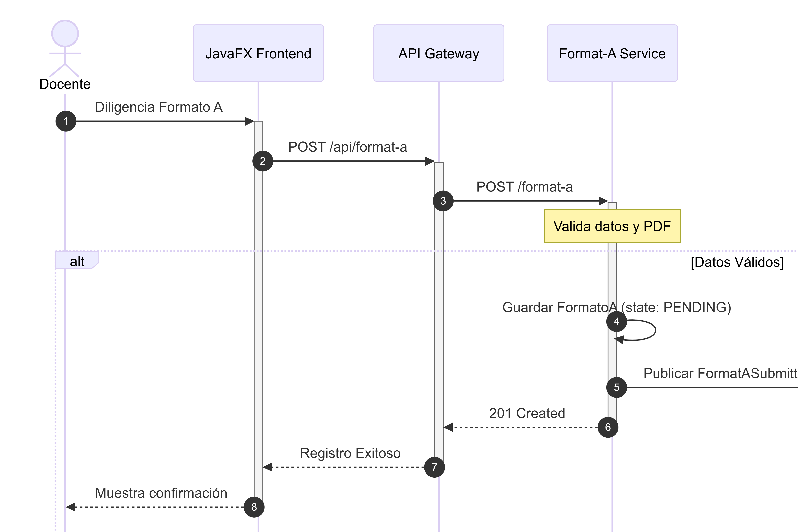
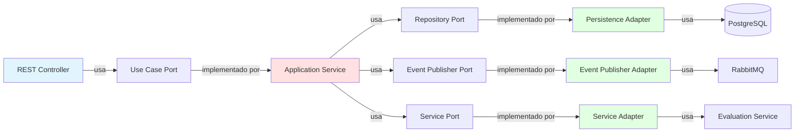
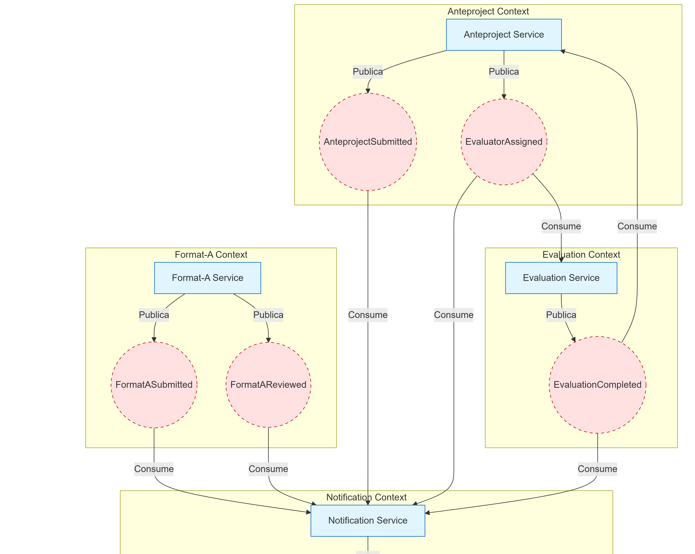

# Arquitectura del Sistema - Process Management Microservices

## Índice
1. [Visión General](#visión-general)
2. [Diagramas C4](#diagramas-c4)
3. [Domain-Driven Design](#domain-driven-design)
4. [Patrones Arquitectónicos](#patrones-arquitectónicos)
5. [Decisiones de Diseño](#decisiones-de-diseño)

## Visión General

El sistema de gestión de procesos académicos está construido siguiendo los principios de **Microservicios**, **Domain-Driven Design (DDD)** y **Arquitectura Hexagonal**. Esta combinación proporciona:

- ✅ **Alta cohesión** y **bajo acoplamiento**
- ✅ **Escalabilidad horizontal** independiente por servicio
- ✅ **Mantenibilidad** mediante separación de responsabilidades
- ✅ **Testabilidad** con dependencias invertidas
- ✅ **Resiliencia** mediante comunicación asíncrona

## Diagramas C4

### Nivel 1: Diagrama de Contexto


**Propósito**: Mostrar cómo el sistema interactúa con usuarios y sistemas externos.

**Actores Principales**:
- **Estudiante**: Envía Formato A y documentos de anteproyecto
- **Profesor/Director**: Revisa y aprueba formatos, dirige anteproyectos
- **Jefe de Departamento**: Asigna evaluadores a anteproyectos
- **Coordinador**: Gestiona todo el proceso académico

**Sistemas Externos**:
- **Email System**: Envío de notificaciones automáticas
- **File Storage**: Almacenamiento de documentos PDF

---

### Nivel 2: Diagrama de Contenedores


**Componentes del Sistema**:

#### Infraestructura
- **API Gateway** (Puerto 8080): Punto de entrada único, autenticación, enrutamiento
- **Eureka Server** (Puerto 8761): Service Discovery, registro de servicios
- **RabbitMQ** (Puerto 5672): Message Broker para eventos asíncronos

#### Microservicios
1. **User Service** (Puerto 8081)
   - Gestión de usuarios y autenticación
   - Base de datos: `user_db` (PostgreSQL)
   
2. **Format-A Service** (Puerto 8082)
   - Gestión de Formatos A
   - Validación de PDFs (máx 10MB)
   - Base de datos: `formata_db` (PostgreSQL)
   
3. **Anteproject Service** (Puerto 8083)
   - Gestión de anteproyectos
   - Asignación de evaluadores
   - Base de datos: `anteproject_db` (PostgreSQL)
   
4. **Evaluation Service** (Puerto 8084)
   - Gestión de evaluaciones
   - Cálculo de calificaciones
   - Base de datos: `evaluation_db` (PostgreSQL)
   
5. **Notification Service** (Puerto 8085)
   - Envío de emails
   - Gestión de plantillas
   - Sin base de datos (stateless)

#### Cliente
- **JavaFX Desktop Client**: Interfaz gráfica de usuario

---

### Nivel 3: Diagrama de Componentes


**Arquitectura Hexagonal** (ejemplo: Anteproject Service):

#### Núcleo de Dominio (Centro)
- **Entidades**: `Anteproject`, `AnteprojectStatus`
- **Casos de Uso**: `AnteprojectApplicationService`
- **Puertos**: Interfaces que definen contratos

#### Adaptadores de Entrada (Izquierda)
- **REST Controller**: Expone API HTTP
- **Event Consumer**: Escucha eventos de RabbitMQ

#### Adaptadores de Salida (Derecha)
- **JPA Repository**: Persistencia en PostgreSQL
- **Event Publisher**: Publica eventos a RabbitMQ
- **REST Clients**: Comunicación con otros servicios

**Ventajas**:
- Dominio independiente de frameworks
- Fácil testing con mocks
- Cambio de tecnología sin afectar lógica de negocio

---

## Domain-Driven Design

### Diagrama de Bounded Contexts


### Contextos Acotados

#### 1. User Management Context 👤
**Responsabilidad**: Gestión de identidad y acceso

**Entidades Principales**:
- `User` (email, password, role, department)

**Servicios**:
- Registro de usuarios
- Autenticación (login/logout)
- Gestión de roles (STUDENT, TEACHER, COORDINATOR, DEPARTMENT_HEAD)

**Relaciones**:
- Proveedor upstream para todos los demás contextos
- Proporciona información de usuarios mediante REST API

---

#### 2. Format Management Context 📄
**Responsabilidad**: Gestión del ciclo de vida de Formatos A

**Entidades Principales**:
- `FormatoA` (título, modalidad, objetivos, PDF)
- `FormatStatus` (PENDING, APPROVED, REJECTED)

**Servicios**:
- Envío de Formato A con PDF
- Revisión y aprobación por coordinador
- Reenvío tras rechazo (máx 3 intentos)

**Relaciones**:
- Upstream de Anteproject Context
- Consumer de User Context
- Publisher de eventos de aprobación

---

#### 3. Anteproject Management Context 📋
**Responsabilidad**: Gestión de anteproyectos

**Entidades Principales**:
- `Anteproject` (formatoAId, título, documento, estado)
- `AnteprojectStatus` (DRAFT, SUBMITTED, UNDER_EVALUATION, APPROVED, REJECTED)

**Servicios**:
- Creación desde Formato A aprobado
- Envío de documento por estudiante/director
- Asignación de evaluadores por jefe de departamento

**Relaciones**:
- Downstream de Format Context
- Upstream de Evaluation Context
- Consumer de User Context

---

#### 4. Evaluation Context ⭐
**Responsabilidad**: Gestión de evaluaciones

**Entidades Principales**:
- `Evaluation` (projectId, evaluatorEmail, score, comments)
- `EvaluationStatus` (PENDING, APPROVED, REJECTED)

**Servicios**:
- Asignación de evaluadores
- Envío de evaluación (score, comentarios)
- Cálculo de resultado final (ambos evaluadores)

**Reglas de Negocio**:
- Score >= 3.0 → APPROVED
- Score < 3.0 → REJECTED
- Se requieren 2 evaluadores

**Relaciones**:
- Downstream de Anteproject Context
- Consumer de User Context

---

#### 5. Notification Context 📧
**Responsabilidad**: Comunicación con usuarios

**Servicios**:
- Envío de emails transaccionales
- Notificaciones de cambios de estado
- Alertas de asignaciones

**Eventos Consumidos**:
- `FormatASubmittedEvent`
- `FormatAReviewedEvent`
- `AnteprojectSubmittedEvent`
- `EvaluatorAssignmentEvent`
- `EvaluationCompletedEvent`

**Relaciones**:
- Downstream de todos los contextos
- Stateless (sin base de datos)

---

## Patrones Arquitectónicos

### 1. Microservicios
**Beneficios**:
- Despliegue independiente
- Escalabilidad selectiva
- Tecnologías heterogéneas
- Equipos autónomos

**Desafíos Resueltos**:
- ✅ Service Discovery con Eureka
- ✅ API Gateway para enrutamiento
- ✅ Comunicación asíncrona con RabbitMQ
- ✅ Base de datos por servicio

---

---

### 2. Flujo Principal (Formato A)

Este diagrama de secuencia ilustra el proceso de envío y validación de un Formato A, mostrando la interacción síncrona y asíncrona entre servicios.



---

### 3. Arquitectura Hexagonal (Ports & Adapters)
**Beneficios**:
- Dominio aislado de infraestructura
- Testabilidad mejorada
- Flexibilidad tecnológica

**Implementación**:
```
domain/
  ├── model/          # Entidades
  ├── ports/
  │   ├── in/         # Casos de uso
  │   └── out/        # Interfaces de salida
application/
  └── usecases/       # Implementación de casos de uso
infrastructure/
  ├── adapters/
  │   ├── in/         # Controllers, Consumers
  │   └── out/        # Repositories, Clients
```

*(El diagrama específico de arquitectura hexagonal está en proceso de inclusión)*

#### Implementación Detallada - Anteproject Service

El `anteproject-service` es el caso de estudio completo de arquitectura hexagonal en el proyecto.

**Estructura de Directorios Real:**
```
anteproject-service/src/main/java/co/unicauca/anteproject/
├── domain/
│   ├── model/
│   │   ├── Anteproject.java              # Entidad del dominio
│   │   └── AnteprojectStatus.java         # Enum de estados
│   └── ports/
│       ├── in/                            # Puertos de entrada
│       │   ├── CreateAnteprojectUseCase.java
│       │   ├── SubmitAnteprojectUseCase.java
│       │   └── AssignEvaluatorsUseCase.java
│       └── out/                           # Puertos de salida
│           ├── AnteprojectRepositoryPort.java
│           ├── AnteprojectEventPublisherPort.java
│           └── EvaluationServicePort.java
├── application/
│   └── service/
│       └── AnteprojectApplicationService.java  # Implementa casos de uso
└── infrastructure/
    ├── input/                             # Adaptadores de entrada
    │   └── rest/
    │       └── AnteprojectController.java
    └── output/                            # Adaptadores de salida
        ├── persistence/
        │   ├── AnteprojectPersistenceAdapter.java
        │   ├── AnteprojectJpaRepository.java
        │   └── mapper/
        │       └── AnteprojectMapper.java
        └── client/
            ├── EventPublisherAdapter.java
            └── EvaluationServiceAdapter.java
```

**Flujo de Datos:**



**Adaptadores Implementados:**

##### 1. AnteprojectPersistenceAdapter
- **Tipo**: Adaptador de salida
- **Propósito**: Adapta JPA Repository al puerto del dominio
- **Implementa**: `AnteprojectRepositoryPort`
- **Tecnología**: Spring Data JPA + PostgreSQL
- **Ubicación**: `infrastructure/output/persistence/AnteprojectPersistenceAdapter.java`

```java
@Component
public class AnteprojectPersistenceAdapter implements AnteprojectRepositoryPort {
    private final AnteprojectJpaRepository jpaRepository;
    private final AnteprojectMapper mapper;
    
    @Override
    public Anteproject save(Anteproject anteproject) {
        AnteprojectEntity entity = mapper.toEntity(anteproject);
        AnteprojectEntity saved = jpaRepository.save(entity);
        return mapper.toDomain(saved);
    }
}
```

##### 2. EventPublisherAdapter
- **Tipo**: Adaptador de salida
- **Propósito**: Publica eventos de dominio a RabbitMQ
- **Implementa**: `AnteprojectEventPublisherPort`
- **Tecnología**: Spring AMQP + RabbitMQ
- **Ubicación**: `infrastructure/output/client/EventPublisherAdapter.java`

##### 3. EvaluationServiceAdapter
- **Tipo**: Adaptador de salida
- **Propósito**: Comunica con evaluation-service vía REST
- **Implementa**: `EvaluationServicePort`
- **Tecnología**: Spring Cloud OpenFeign
- **Ubicación**: `infrastructure/output/client/EvaluationServiceAdapter.java`

**Beneficios Obtenidos:**
- ✅ Dominio completamente independiente de Spring Framework
- ✅ Tests unitarios sin necesidad de base de datos
- ✅ Fácil cambio de RabbitMQ a Kafka (solo cambiar adaptador)
- ✅ Código de negocio aislado y reutilizable
- ✅ Mocks fáciles de crear para testing

---

### 3. Event-Driven Architecture


**Eventos Principales**:


| Evento | Publisher | Consumers |
|--------|-----------|-----------|
| `FormatASubmittedEvent` | Format-A Service | Notification Service |
| `FormatAReviewedEvent` | Format-A Service | Notification Service |
| `AnteprojectSubmittedEvent` | Anteproject Service | Notification Service |
| `EvaluatorAssignmentEvent` | Anteproject Service | Evaluation Service, Notification Service |
| `EvaluationCompletedEvent` | Evaluation Service | Anteproject Service, Notification Service |

**Ventajas**:
- Desacoplamiento temporal
- Escalabilidad asíncrona
- Resiliencia (retry automático)
- Auditoría de eventos

---

### 4. Database per Service
Cada microservicio tiene su propia base de datos:

```
user-service        → user_db
format-a-service    → formata_db
anteproject-service → anteproject_db
evaluation-service  → evaluation_db
```

**Ventajas**:
- Autonomía de datos
- Escalabilidad independiente
- Cambios de esquema sin coordinación

**Desafíos**:
- ✅ Consistencia eventual con eventos
- ✅ Queries distribuidas mediante APIs
- ✅ Transacciones distribuidas evitadas (Saga pattern potencial)

---

### 5. Design Patterns

El proyecto implementa **6 patrones de diseño clásicos** distribuidos estratégicamente en los microservicios.

Para documentación completa y detallada, consultar [DESIGN_PATTERNS.md](../DESIGN_PATTERNS.md).

**Resumen de Patrones:**

| Patrón | Categoría | Microservicio | Propósito |
|--------|-----------|---------------|----------|
| State | Comportamiento | format-a-service | Gestión de estados del ciclo de vida |
| Builder | Creacional | user-service | Construcción validada de objetos User |
| Factory | Creacional | notification-service | Creación de mensajes de email |
| Adapter | Estructural | anteproject-service | Hexagonal architecture |
| Decorator | Estructural | notification-service | Logging en email service |
| Facade | Estructural | presentation | Simplificación de API backend |

**Distribución:**
- Patrones de Comportamiento: 1
- Patrones Creacionales: 2
- Patrones Estructurales: 3

---

### 6. Containerización con Docker

**Estado Actual:**

El proyecto ha iniciado la containerización de servicios para facilitar el despliegue y desarrollo.

**Servicios Dockerizados:**
- ✅ **PostgreSQL** (imagen oficial `postgres:15`)
- ✅ **User Service** (Dockerfile custom con Java 17)

**Configuración Docker Compose:**

```yaml
services:
  postgres-db:
    image: postgres:15
    ports: ["5432:5432"]
    volumes: [postgres-data:/var/lib/postgresql/data]
    networks: [microservices-network]
  
  user-service:
    build: ./ProccesManagementMicroservices/user-service
    ports: ["8081:8082"]
    depends_on: [postgres-db]
    networks: [microservices-network]
```

**Dockerfile del User Service:**

```dockerfile
FROM eclipse-temurin:17-jdk-alpine
VOLUME /tmp
ARG JAR_FILE=target/*.jar
COPY ${JAR_FILE} app.jar
ENTRYPOINT ["java","-jar","/app.jar"]
```

**Características:**
- Imagen base ligera (Alpine Linux)
- Java 17 optimizado (Eclipse Temurin)
- Volumen temporal para archivos
- Puerto expuesto: 8082

**Estrategia de Containerización:**

**Fase 1 (Completada):**
- ✅ PostgreSQL containerizado
- ✅ User Service con Dockerfile
- ✅ Red de microservicios configurada (`microservices-network`)
- ✅ Volúmenes persistentes para datos

**Fase 2 (Planificada):**
- [ ] Dockerizar servicios restantes (format-a, anteproject, evaluation, notification)
- [ ] Dockerizar infraestructura (gateway, discovery, RabbitMQ)
- [ ] Multi-stage builds para optimización de tamaño
- [ ] Health checks en contenedores
- [ ] Docker Compose completo para desarrollo

**Fase 3 (Futuro):**
- [ ] Kubernetes para producción
- [ ] Helm charts para despliegue
- [ ] CI/CD con GitHub Actions
- [ ] Registry privado de imágenes

**Beneficios de la Containerización:**
- ✅ Entorno de desarrollo consistente
- ✅ Fácil onboarding de nuevos desarrolladores
- ✅ Aislamiento de dependencias
- ✅ Portabilidad entre entornos (dev, staging, prod)
- ✅ Escalabilidad horizontal simplificada

---

## Decisiones de Diseño

### 1. ¿Por qué Arquitectura Hexagonal?
- **Testabilidad**: Mocks fáciles de puertos
- **Mantenibilidad**: Cambios de infraestructura sin afectar dominio
- **Claridad**: Separación explícita de responsabilidades

### 2. ¿Por qué RabbitMQ?
- **Madurez**: Probado en producción
- **Fiabilidad**: Persistencia de mensajes
- **Flexibilidad**: Múltiples patrones (pub/sub, work queues)
- **Spring Integration**: Soporte nativo en Spring Boot

### 3. ¿Por qué PostgreSQL?
- **Robustez**: ACID completo
- **Características**: JSON, índices avanzados
- **Escalabilidad**: Réplicas de lectura
- **Gratuito**: Open source

### 4. ¿Por qué JavaFX para Frontend?
- **Requisito**: Aplicación de escritorio
- **Integración**: Nativa con Java
- **Rendimiento**: Mejor que web para desktop
- **Offline**: Funciona sin conexión (con caché)

---

## Próximos Pasos

### Mejoras Planificadas
1. **Seguridad**:
   - [ ] JWT con refresh tokens
   - [ ] OAuth2 para SSO
   - [ ] Encriptación de datos sensibles

2. **Observabilidad**:
   - [ ] Prometheus + Grafana
   - [ ] ELK Stack (logs centralizados)
   - [ ] Distributed tracing (Zipkin/Jaeger)

3. **Resiliencia**:
   - [ ] Circuit Breakers (Resilience4j)
   - [ ] Rate Limiting
   - [ ] Bulkheads

4. **Performance**:
   - [ ] Redis para caché distribuido
   - [ ] CDN para assets estáticos
   - [ ] Connection pooling optimizado

---

## Referencias

- [C4 Model](https://c4model.com/)
- [Domain-Driven Design](https://martinfowler.com/bliki/DomainDrivenDesign.html)
- [Hexagonal Architecture](https://alistair.cockburn.us/hexagonal-architecture/)
- [Microservices Patterns](https://microservices.io/patterns/)
- [Spring Cloud](https://spring.io/projects/spring-cloud)
